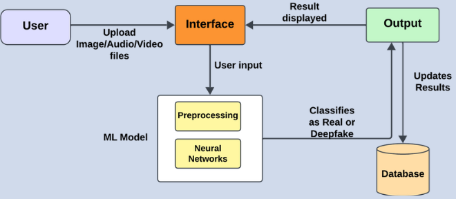
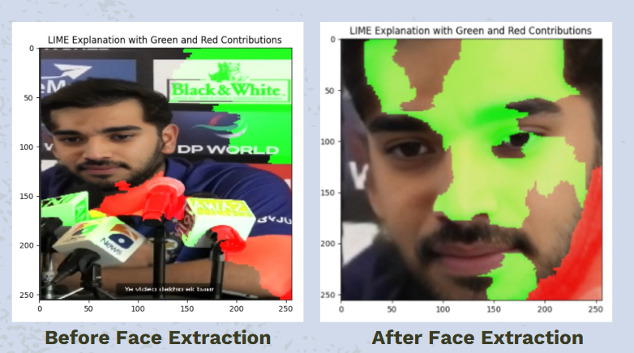
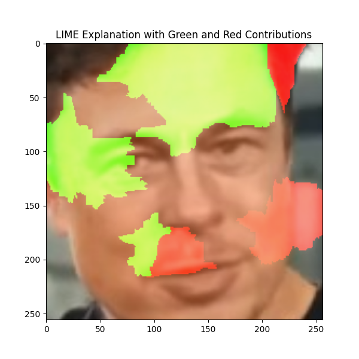
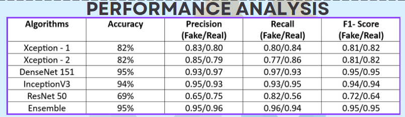

# Deepfake Detection Model

This repository contains a deep learning-based model for detecting deepfake images. The model uses a combination of multiple pre-trained models, aggregated to provide robust and accurate predictions. The goal is to detect whether an image is real or fake.

 

## Overview

This model leverages deep learning techniques to classify images as real or fake. By using multiple pre-trained models and an aggregation method for predictions, it ensures accurate and reliable results.

**Key Features:**
- **Multiple Model Approaches:** Utilizes diverse pre-trained models for enhanced performance.
- **Prediction Voting System:** Aggregates predictions from multiple models to improve accuracy.
- **Face Detection:** Uses OpenCV's Haar Cascade to focus the model’s attention on the face area in the image.
- **LIME Integration:** Provides an explanation of model predictions by visualizing which parts of the image contributed to the decision.

  

## Models  

The model was trained using the following datasets:  

### **Image Datasets**  
- [140K Real and Fake Faces Dataset](https://www.kaggle.com/datasets/xhlulu/140k-real-and-fake-faces)  
- [Deepfake and Real Images Dataset](https://www.kaggle.com/datasets/manjilkarki/deepfake-and-real-images)  

### **Audio Datasets**  
- [ASVspoof 2019 Dataset](https://www.kaggle.com/datasets/awsaf49/asvpoof-2019-dataset)  
- [In the Wild (Audio Deepfake)](https://www.kaggle.com/datasets/abdallamohamed312/in-the-wild-audio-deepfake)  

These datasets provided the images necessary to train and evaluate the deepfake detection models.

## Installation

To use this project, you need to install the required dependencies.

1. Clone the repository:
   ```bash
   git clone https://github.com/yourusername/deepfake-detection.git
   cd deepfake-detection

2. Install dependencies
   ```bash
   pip install -r requirements.txt   

## Usage

### 1. Running the Model Prediction

Once the repository is cloned and dependencies are installed, you can use the model to predict if an image is real or fake.

**Functionality:**

* The model expects an image input (in formats such as .jpg, .png).
* The model preprocesses the image (including face detection, cropping, and resizing).
* Then, the model aggregates the predictions from multiple pre-trained models.

### 2. Preprocessing the Image

Before making predictions, the image goes through several preprocessing steps:

* **Face Detection:** Using OpenCV's Haar Cascade, the face(s) in the image are detected.
* **Cropping and Resizing:** Once the face is detected, the image is cropped and resized to fit the model's input size.
* **Normalization:** The pixel values are normalized to be within the [0,1] range to match the training conditions.

### 3. LIME Integration for Model Explanations

LIME (Local Interpretable Model-Agnostic Explanations) helps explain which parts of the image contributed to the prediction. The explanation helps visualize how the model makes its decisions by highlighting key regions.




### 4. Evaluating the Model Performance

After training the model, you can evaluate its performance using accuracy, F1 score, ROC curve, and AUC:


**Input/Output**

* **Input:** Image File: The system accepts an image file in JPG, PNG, or other common formats.
* **Output:**
    * **Prediction:** The output will indicate whether the image is real or fake.
    * **Confidence Scores:** The output also provides the confidence levels for both real and fake predictions.

 


