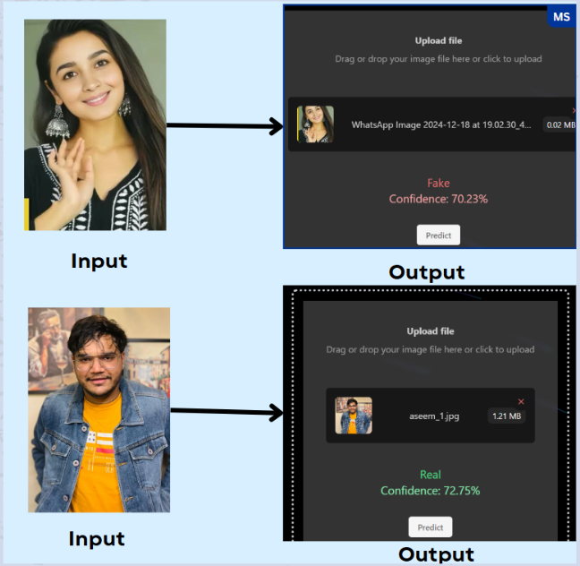

# Deepfake Detection Model

This repository contains a deep learning-based model for detecting deepfake multimedia. The model uses a combination of multiple pre-trained models, aggregated to provide robust and accurate predictions. The goal is to detect whether the file uploaded is real or fake.

 

## Overview
Deepfakes are a form of synthetic media created using artificial intelligence, especially deep learning techniques like **Generative Adversarial Networks (GANs)**. They allow for the creation of highly realistic but altered content, such as videos, images, or audio, that can make it seem like someone said or did something they never actually did.

This model leverages deep learning techniques to classify images, audio and videos as real or fake. By using multiple pre-trained models and an aggregation method for predictions, it ensures accurate and reliable results.

## Key Features

- **Image Detection:** Leverages transfer learning with advanced base models such as XceptionV3, InceptionV3, ResNet, and DenseNet to extract and identify complex image features. Ensemble methods are employed to combine predictions from these models, effectively reducing bias toward specific classes and improving accuracy.

- **Video Detection:** Processes video data by extracting one frame per second. Each extracted frame is fed into the image detection model, and a voting mechanism is applied to aggregate the results across frames, ensuring a reliable final prediction.

- **Audio Detection:** Converts audio data into mel spectrograms, enabling the model to analyze time-frequency features. These spectrograms are processed by a Convolutional Neural Network (CNN) to detect unique patterns indicative of manipulated or synthetic audio content.

## Models  

The model was trained using the following datasets:  

### **Image Datasets**  
- [140K Real and Fake Faces Dataset](https://www.kaggle.com/datasets/xhlulu/140k-real-and-fake-faces)  
- [Deepfake and Real Images Dataset](https://www.kaggle.com/datasets/manjilkarki/deepfake-and-real-images)  

### **Audio Datasets**  
- [ASVspoof 2019 Dataset](https://www.kaggle.com/datasets/awsaf49/asvpoof-2019-dataset)  
- [In the Wild (Audio Deepfake)](https://www.kaggle.com/datasets/abdallamohamed312/in-the-wild-audio-deepfake)  

These datasets provided the images necessary to train and evaluate the deepfake detection models.

## Pre-trained Models for Deepfake Detection

You can access the pre-trained models for deepfake detection on Kaggle: [Deepfake Detection Model](https://www.kaggle.com/models/aestroe/deepfake-detection)

## Kaggle Notebooks

Here are some Kaggle notebooks related to deepfake detection:

- [DeepDetect](https://www.kaggle.com/code/aestroe/deepdetect)
- [Audio Detect](https://www.kaggle.com/code/aestroe/audio-detect)

These notebooks show how to run and test the models for real-time predictions, including image, video, and audio deepfake detection.

## Installation

To use this project, you need to install the required dependencies.

1. Clone the repository:
   ```bash
   git clone https://github.com/yourusername/deepfake-detection.git
   cd deepfake-detection

2. Install dependencies
   ```bash
   pip install -r requirements.txt   

## Usage

### 1. Running the Model Prediction

Once the repository is cloned and dependencies are installed, you can use the model to predict if an image is real or fake.

**Functionality:**

* The model expects an image input (in formats such as .jpg, .png).
* The model preprocesses the image (including face detection, cropping, and resizing).
* Then, the model aggregates the predictions from multiple pre-trained models.

### 2. Preprocessing the Image

Before making predictions, the image goes through several preprocessing steps:

* **Face Detection:** Using OpenCV's Haar Cascade, the face(s) in the image are detected.
* **Cropping and Resizing:** Once the face is detected, the image is cropped and resized to fit the model's input size.
* **Normalization:** The pixel values are normalized to be within the [0,1] range to match the training conditions.

### 3. LIME Integration for Model Explanations

LIME (Local Interpretable Model-Agnostic Explanations) helps explain which parts of the image contributed to the prediction. The explanation helps visualize how the model makes its decisions by highlighting key regions.
 


## Evaluating the Model Performance

The model's performance is assessed using the following metrics:

- Accuracy: Measures overall correctness.
- F1 Score: Balances precision and recall.


## Input/Output

* **Input:** Image File: The system accepts an image file in JPG, PNG, or other common formats.
* **Output:**
    * **Prediction:** The output will indicate whether the image is real or fake.
    * **Confidence Scores:** The output also provides the confidence levels for both real and fake predictions.


 
## Contributions
Contributions are welcome! If you would like to improve the model or documentation:

- Fork the repository.
- Make your changes.
- Submit a pull request with a detailed description.

## License

This project is licensed under the MIT License - see the [LICENSE](LICENSE) file for details.


